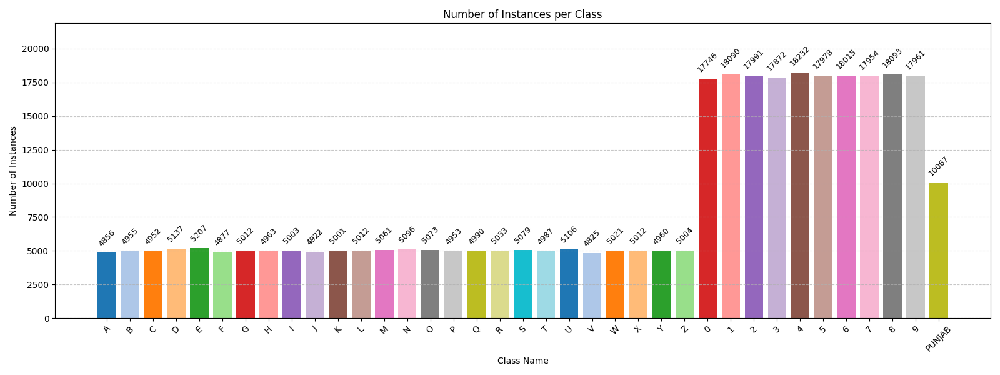
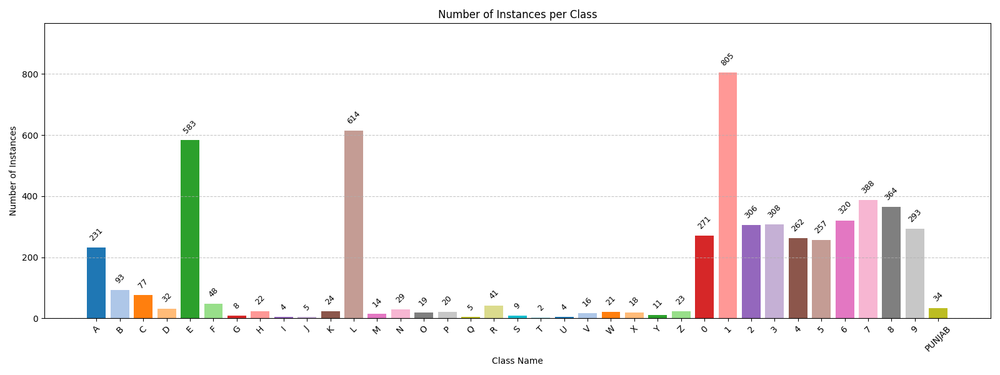
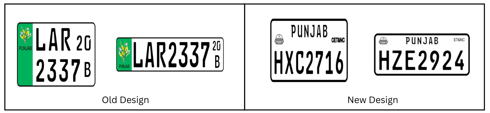
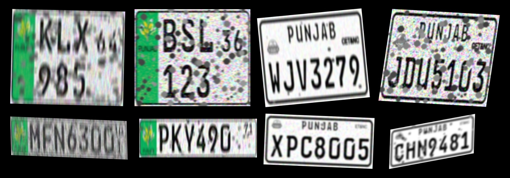

# Punjab Pakistan Synthetic and Real License Plate Character Datasets (P-LPCD)

This repository contains all code, scripts, and supporting files for the **Punjab Pakistan License Plate Character Datasets (P-LPCD)**, which consists of **two sub-datasets**:

- **PS-LPCD** (Punjab Synthetic License Plate Character Dataset)  
  - Synthetic dataset for pretraining  
  - Includes scripts and utilities to generate synthetic license plate characters  

- **PR-LPCD** (Punjab Real License Plate Character Dataset)  
  - Real-world dataset for fine-tuning and evaluation  
  - Includes annotated images of actual Punjab license plates  

Additional supporting files and folders:

- **dataset_info/**: Metadata, visualizations, class distributions, license plate templates, and sample variations  
- **synthetic_generator/**: Code to generate your own PS-LPCD synthetic dataset  

> ⚠️ **Note:** Both datasets are specifically created for **Punjab, Pakistan license plates** using **only 4 official templates** for synthetic generation.  
> They are **not general or global license plate datasets**.

---

## Dataset Info (`dataset_info/`)

This folder contains additional details and visualizations for **PS-LPCD** and **PR-LPCD**. You can **download the files directly**.

### Class Distributions

- **PS-LPCD:**  
    
  [Download PNG](dataset_info/class_instance_distribution_PS-LPCD.png)  
  [Download CSV](dataset_info/class_instance_counts_PS-LPCD.xlsx)  

- **PR-LPCD:**  
    
  [Download PNG](dataset_info/class_instance_distribution_PR-LPCD.png)  
  [Download CSV](dataset_info/class_instance_counts_PR-LPCD.xlsx)  

### License Plate Templates

  
[Download PNG](dataset_info/lp_templates.png)  
- Visual reference of the **4 templates** used for synthetic generation.

### Synthetic Variations

  
[Download PNG](dataset_info/lp_variations.png)  
- Sample images from **PS-LPCD** after applying real-life variations (noise, blur, lighting changes).

> **Note:** These files are for documentation and analysis only.  

---

## Dataset Summary

| Dataset | Train | Val/Test | Total | Purpose |
|---------|-------|----------|-------|---------|
| **PS-LPCD** | 32,000 | 8,000 (val) | 40,000 | Pretraining (synthetic) |
| **PR-LPCD** | 500 | 150 (test) | 650 | Fine-tuning & real-world evaluation |

---

## Recommended Workflow

1. Train models on **PS-LPCD** (`train/ + val/`) to learn general features from synthetic plates.  
2. Fine-tune on **PR-LPCD** (`train/`) to adapt to real-world license plates.  
3. Evaluate on **PR-LPCD** (`test/`) to measure real-world accuracy.  

---

## Label Format

All annotations follow **YOLO format** (`.txt`):

```
<class_id> <x_center> <y_center> <width> <height>
```

- `class_id` : numeric ID of the character  
- `x_center` : normalized x-coordinate of box center (0–1)  
- `y_center` : normalized y-coordinate of box center (0–1)  
- `width`    : normalized box width (0–1)  
- `height`   : normalized box height (0–1)  

---

## Applications

- License plate character detection and recognition  
- Synthetic-to-real domain adaptation  
- Benchmarking OCR pipelines for license plates  

---

## Synthetic Generator

The `synthetic_generator/` folder contains **code and scripts** to generate your own **PS-LPCD synthetic dataset**, including variations to mimic real-world conditions.

---

## Test Videos (`test_videos/`)

This folder contains **5 sample videos (~40 MB each)** that can be used to test the License Plate Character Dataset (LPCD) in real-world conditions.

> ⚠️ **Git LFS is required** to download the full videos. After cloning the repo:  
```bash
git lfs install   # only once per machine
git lfs pull      # downloads the actual video files
```

---

## Citation

If you use **P-LPCD** in research, please cite the Zenodo dataset:

```
Mohamed Rafi, A., Mohamed Buhary, F. A. F., & Ishaq Khan, A. (2025). Punjab Pakistan Synthetic and Real License Plate Character Datasets (P-LPCD) (1.0.0) [Data set]. Zenodo. https://doi.org/10.5281/zenodo.17182320
```

---

## License

This repository and associated files are licensed under **Creative Commons Attribution-NonCommercial 4.0 International (CC BY-NC 4.0)**.  

- **Non-commercial use only**  
- Must give proper **attribution**  
- Full license text: [https://creativecommons.org/licenses/by-nc/4.0/legalcode](https://creativecommons.org/licenses/by-nc/4.0/legalcode)
